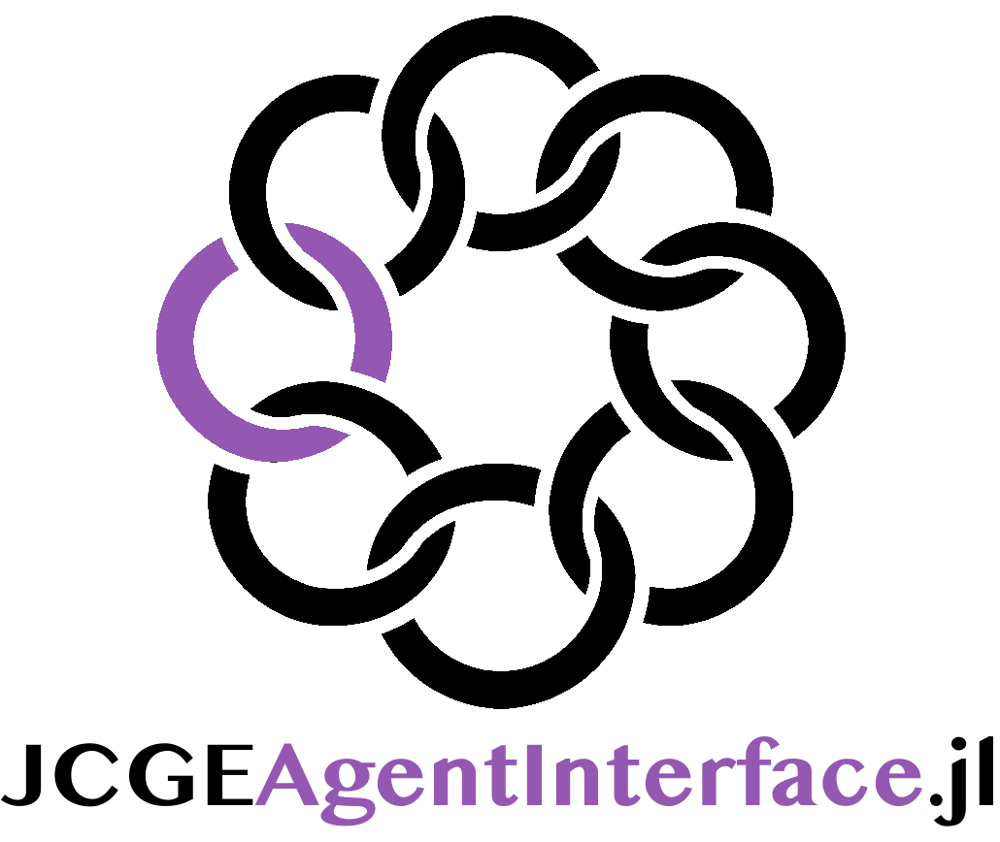

<picture>
  <source media="(prefers-color-scheme: dark)" srcset="docs/src/assets/jcge_agentinterface_logo_dark.png">
  <source media="(prefers-color-scheme: light)" srcset="docs/src/assets/jcge_agentinterface_logo_light.png">
  
</picture>

# JCGEAgentInterface

<!-- mcp-name: io.github.equicirco/JCGEAgentInterface.jl -->

## What is a CGE?
A Computable General Equilibrium (CGE) model is a quantitative economic model that represents an economy as interconnected markets for goods and services, factors of production, institutions, and the rest of the world. It is calibrated with data (typically a Social Accounting Matrix) and solved numerically as a system of nonlinear equations until equilibrium conditions (zero-profit, market-clearing, and income-balance) hold within tolerance.

## What is JCGE?
[JCGE](https://jcge.org) is a block-based CGE modeling and execution framework in Julia. It defines a shared RunSpec structure and reusable blocks so models can be assembled, validated, solved, and compared consistently across packages.

## What is this package?
MCP-compatible interface layer for agents that need to discover, load, solve, validate, and inspect

[JCGE](https://jcge.org) models. It exposes a small action API and a standard MCP stdio server over the same functionality.

The agent surface is intentionally focused on:

- discovering installed JCGE packages and available functionality,
- listing and describing reusable `JCGEBlocks` components,
- guiding users through CGE model development with JCGE blocks,
- guiding formulation choices such as equality systems, inequalities, MCP/complementarity, and optimization-style representations,
- guiding calibration with the currently available `JCGECalibrate` loaders, SAM helpers, labeled containers, and parameter workflows,
- guiding solver choice and reporting from generated equations,
- solving registered `RunSpec` models,
- validating solved contexts,
- rendering implemented equations, blocks, and symbols through `JCGEOutput`,
- reporting or applying updates to released JCGE packages in the active Julia environment.

The package services are grouped in the documentation as discovery, modeling
guidance, model interaction, reporting, environment maintenance, and MCP runtime
services. See `docs/src/services.md` for the full service contract and current
limits.

## MCP server

The standard MCP transport is:

```julia
using JCGEAgentInterface
serve(transport=:mcp_stdio)
```

Minimal local MCP client configuration:

```json
{
  "mcpServers": {
    "jcge": {
      "command": "julia",
      "args": [
        "--project=/path/to/JCGEAgentInterface.jl",
        "-e",
        "using JCGEAgentInterface; serve(transport=:mcp_stdio)"
      ]
    }
  }
}
```

The MCP tools use the `jcge_` prefix:

- `jcge_capabilities`
- `jcge_list_blocks`
- `jcge_describe_block`
- `jcge_modeling_guide`
- `jcge_formulation_guide`
- `jcge_solver_guide`
- `jcge_calibration_guide`
- `jcge_reporting_guide`
- `jcge_package_status`
- `jcge_update_packages`
- `jcge_list_models`
- `jcge_load_model`
- `jcge_solve`
- `jcge_validate_model`
- `jcge_render_model`
- `jcge_export_results`

The original custom JSON action protocol remains available:

`serve()` reads JSON requests from stdin and writes JSON responses to stdout.

## Docker and MCP Registry

OCI-oriented MCP registry metadata is declared in [`server.json`](server.json).

Future version tags matching `v*.*.*` trigger `.github/workflows/publish-mcp.yml`, which:

- verifies the tag version matches `Project.toml`,
- builds the MCP Docker image,
- pushes it to GitHub Container Registry as `ghcr.io/equicirco/jcge-agentinterface-mcp:<release-version>`,
- updates `server.json` for that release,
- publishes the metadata to the official MCP Registry through GitHub OIDC.

The Docker image includes the MCP ownership label required by the MCP Registry:

```dockerfile
LABEL io.modelcontextprotocol.server.name="io.github.equicirco/JCGEAgentInterface.jl"
```

No release, tag, image publication, or registry publication is performed by editing this repository.

## How to cite

If you use the [JCGE](https://jcge.org) framework, please cite:

Boero, R. *JCGE - Julia Computable General Equilibrium Framework* [software], 2026.
DOI: 10.5281/zenodo.18282436
URL: https://JCGE.org

```bibtex
@software{boero_jcge_2026,
  title  = {JCGE - Julia Computable General Equilibrium Framework},
  author = {Boero, Riccardo},
  year   = {2026},
  doi    = {10.5281/zenodo.18282436},
  url    = {https://JCGE.org}
}
```

If you use this package, please cite:

Boero, R. *JCGEAgentInterface.jl - MCP-compatible agent interface for JCGE tooling.* [software], 2026.
DOI: 10.5281/zenodo.18335121
URL: https://AgentInterface.JCGE.org
SourceCode: https://github.com/equicirco/JCGEAgentInterface.jl

```bibtex
@software{boero_jcgeagentinterface_2026,
  title  = {JCGEAgentInterface.jl - MCP-compatible agent interface for JCGE tooling.},
  author = {Boero, Riccardo},
  year   = {2026},
  doi    = {10.5281/zenodo.18335121},
  url    = {https://AgentInterface.JCGE.org}
}
```

If you use a specific tagged release, please cite the version DOI assigned on Zenodo for that release (preferred for exact reproducibility).
